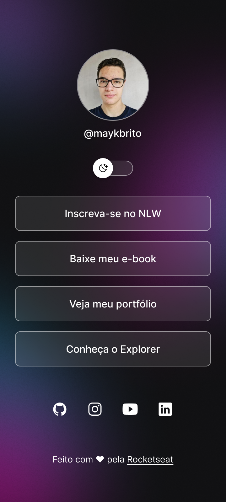
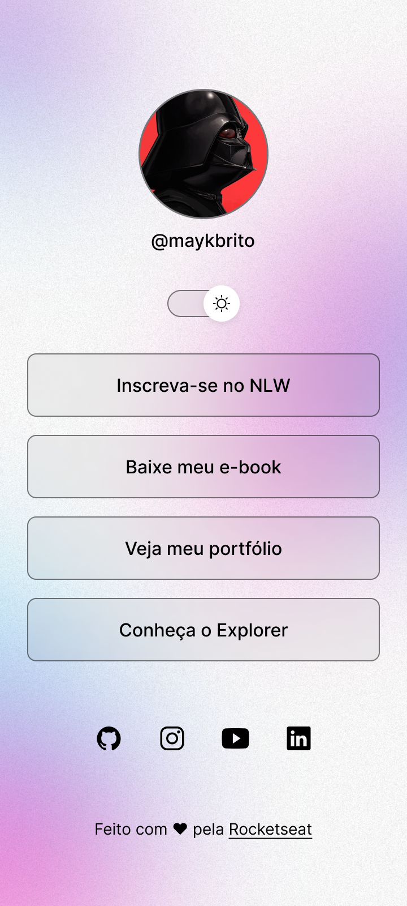

# dev-links

Repositório criado para o curso gratuito de 5 horas da rocketseat, disponibilizado em dezembro de 2022.

### 🛠 Tecnologias Utilizadas

- Html
- Css
- JavaScript

## Screenshots

<!-- ## Certificado

 -->

[🔗 Clique aqui para acessar](https://gabrielvictorino8266.github.io/dev-links)
